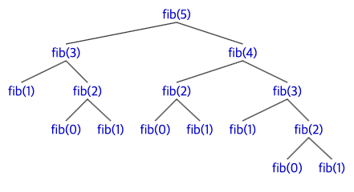

- [알고리즘 : 효율, 분석, 차수](#알고리즘--효율-분석-차수)
  - [1.1 알고리즘](#11-알고리즘)
    - [1.2 효율적인 알고리즘 개발의 중요성](#12-효율적인-알고리즘-개발의-중요성)
    - [1.2.1 순차검색 vs 이분검색](#121-순차검색-vs-이분검색)
    - [1.2.2 피보나치 수열](#122-피보나치-수열)
  - [1.3 알고리즘의 분석](#13-알고리즘의-분석)
    - [1.3.1 시간복잡도 분석](#131-시간복잡도-분석)
# 알고리즘 : 효율, 분석, 차수
## 1.1 알고리즘
이 책은 특정 언어가 아닌 알고리즘 기법을 배우는 책이다.

특정한 문제를 어떤 알고리즘으로 풀지, 해당 알고리즘이 시간과 공간의 사용량을 기준으로 얼마나 효율적인지를 분석하는데 관심을 가져야한다.

그렇기 때문에 모든 알고리즘은 C++을 기반으로한 **의사코드(pseudocode)** 로 표현한다.

의사코드의 예
~~~cpp
number sum (int n, const number S[])
{
    index i;
    number result;

    result = 0;
    i=1~n까지 반복:
        result = result + S[i];
    return result;
}
~~~
위와 같이 c++의 정확한 문법보다는 사람이 쉽게 이해하는 것에 초점을 두고 작성하는 것이 의사코드이다. 실제로 동작하진 않는다.
### 1.2 효율적인 알고리즘 개발의 중요성
같은 문제에대한 두 개의 알고리즘을 비교해보면 알고리즘의 효율성이 왜 중요한지 알 수 있다.
### 1.2.1 순차검색 vs 이분검색
(정렬된 리스트)  
순차검색 : 찾고자 하는 원소가 나올 때까지 첫번째 요소부터 끝까지 하나하나 탐색하는 방법.  
이분검색 : 반 씩 잘라서 탐색
~~~cpp
(이분검색 의사코드)
void binsearch(int n, const keytype S[], keytype x, index& location)
{
    index low, high, mid;

    low = 1; high = n;
    location = 0;
    while (low <= high && location == 0) {
        mid = 내림((low + high)/2);
        if (x == S[mid])
            location = mid; // 위치 반환
        else if (x < S[mid])
            high = mid -1; // low~high 범위를 mid 이전으로
        else
            low = mid + 1; // low~high 범위를 mid 이후로
    }
}
~~~
|배열의 크기|순차검색 횟수|이분검색 횟수|
|---|---|---|
|128|128|8|
|1,024|1,024|11|
|1,048,576|1,048,576|21|
|4,294,967,296|4,294,967,296|33|  

위의 표로 알 수 있듯이 알고리즘에 따라 효율성이 굉장히 크게 차이날 수 있다.  
하지만 40억 번의 검색 횟수도 컴퓨터의 발전으로 몇 초 정도 밖에 걸리지 않아 알고리즘의 중요성이 크게 부각되지 않을 수 있다. 이번에는 피보나치 수열의 경우를 살펴보자.
### 1.2.2 피보나치 수열
피보나치 수열은 다음과 같이 정의된다.
$$
\begin{aligned}
f_0 &= 0,\\
f_1 &= 1,\\
f_n &= f_{n-1} + f_{n-2}
\end{aligned}
$$

피보나치 수열을 간단히 재귀로 구현하면

~~~cpp
int fib1 (int n)
{
    if (n <= 1)
        return n;
    else
        return fib1(n-1) + fib1(n-2);
}
~~~
  
피보나치를 재귀로 구현했을 경우에 fib(5)를 출력하기 위해서 재귀된 함수를 표현한 트리이다.  
트리에서 알 수 있듯이 재귀로 구현할 경우 너무 많은 함수를 중복해서 호출한다.  
위의 경우에서는 fib(1)이 다섯번 호출되는 것을 확인할 수 있다.  
함수의 총 호출 횟수는 fib(n)에서 n이 커질 수록 기하급수적으로 커져서 200번째 항을 구하는데 $1.3\times10^{30}$번이나 호출하게 된다.

이는 fib(0)이나 fib(1)을 한번 호출하는데 $10^{-9}$초가 걸린다고 가정해도 최소 40조년이 걸린다는 의미이다.

이번에는 정적 배열에 피보나치 수열을 저장하는 방식으로 구현한 코드를 보자.
~~~cpp
int fib2 (int n)
{
    index i;
    int f[0~n];

    f[0] = 0;
    if (n > 0) {
        f[1] = 1;
        for (i = 2; i <= n; i++)
            f[i] = f[i-1] + f[i-2];
    }
    return f[n];
}
~~~
이 코드는 199번의 덧셈만으로 200번째의 피보나치 수열을 구할 수 있다.  
(피보나치 수열을 단 한번만 구하면 되는 경우엔 정적 배열 없이 두개의 int 변수에 마지막 두개의 피보나치 수열만을 저장해서 메모리 사용량까지 줄일 수 있다.)  
이를 통해 알고리즘 효율성이 왜 중요한지에 대해 명확히 알 수 있다.

피보나치 수열 첫번째 코드는 분할정복 알고리즘, 두번째 코드는 동적계획법의 사례이다.  
피보나치 수열의 경우엔 분할정복으로 해결하면 굉장히 비효율적이지만 동일하게 분할정복 알고리즘인 이분검색 알고리즘은 매우 효율적인 것 또한 확인할 수 있다.
## 1.3 알고리즘의 분석
### 1.3.1 시간복잡도 분석
알고리즘의 효율성 분석할 때는 실제 작동시간을 이용하지 않는다. 측정하는 하드웨어에 따라 결과가 달라질 수 있기 때문이다. 따라서 우리는 컴퓨터, 프로그래밍언어 등등의 실행시간에 영향을 줄 수 있는 변수들과는 독립적인 측정법이 필요하다.

이 책에서는 빅오 표기법(big $O$)과 더불어 여러 측정법과 수학적 증명을 서술하지만 간단하게 빅오 표기법에 대해서만 정리한다.

~~~
big-O 표기법

알고리즘 성능이 최악인 경우(수행 시간의 상한)를 나타낼 때 사용하는 시간복잡도 표기법.  
일반적으로 쓰이는 예시는 다음과 같다.  
O(1) < O(logn) < O(n) < O(nlogn) < O(n^2) < O(2^n)
~~~