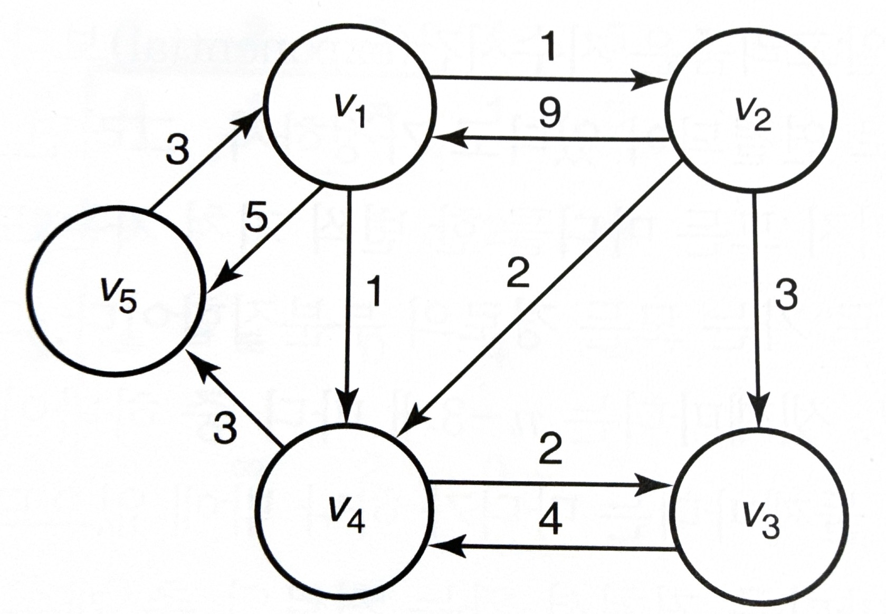

# 동적계획(DP)
동적계획(dynamic programming)은 분할정복과 반대로 바텀업(bottom-up) 접근 방법이다. 

동적계획은 문제의 입력사례를 분할하여 문제를 푼다는 점에서 분할정복과 비슷하지만 분할한 입력사례를 재귀 호출하여 답을 얻는 대신 가장 작은 입력사례의 답을 구해 저장해놓고, 필요하면 꺼내 쓴다. 동적계획의 계획이란 해답을 구하기 위해서 미리 배열(테이블)을 구축하는 것을 뜻한다.

Chapter1의 피보나치 알고리즘이 전형적인 동적계획이다. 피보나치 항을 순서대로 구한 뒤 값을 저장해 놓고 필요할 때마다 배열에 접근해 피보나치 항을 구한다.  
동적계획 알고리즘의 절차는 다음과 같다.
~~~
1. 문제의 입력사례에 대해서 해답을 계산하는 재귀 관계식을 세운다.
2. 작은 입력사례부터 먼저 해결하는 상향식 방법으로 전체 입력사례에 대한 해답을 구한다.
~~~
## 3.1 이항계수 구하기
이항계수란 n에서 뽑은 k개의 순서 없는 조합의 가짓수이다.

$$
\begin{aligned}
\binom{n}{k} = \frac{n!}{k!(n-k)!},\quad 0 \le k \le n
\end{aligned}
$$
이 식의 경우 바로 알고리즘에 적용하기는 어렵다. n! 값이 기하급수적으로 커지기 때문이다.  
다음과 같은 수식을 이용하면 $n!$ 이나 $k!$ 값을 구하지 않고도 이항계수를 구할 수 있다.
$$
\binom{n}{k} =
\begin{cases}
\binom{n-1}{k-1}+\binom{n-1}{k}, & 0 < k < n, \\
\quad \quad \ \ \ 1\quad \quad \ \ ,  & k=0\quad 또는\quad k=n
\end{cases}
$$

~~~cpp
int bin (int n, int k)
{
    if (k == 0 || n == k)
        return 1;
    else
        return bin(n-1, k-1) + bin(n-1, k);
}
~~~
하지만 이 코드의 경우, 예를들어 bin(n-1, k-1), bin(n-1, k) 둘 모두 bin(n-2, k-1)이 필요하고 각각 재귀로 중복 연산하는 것을 알 수 있다. 따라서 동적계획으로 이전 값들을 저장하며 연산하는 알고리즘이 필요하다. 배열 $B[i][j]$에 $\binom{i}{j}$ 값을 저장하며 계산해보자.
~~~cpp
int bin2(int n, int k)
{
    index i, j;
    int B[0~n][0~k];

    for(i = 0; i <= n; i++) {
        for(j = 0; j <= min(i, k); j++) {
            if (j == 0 || j == i)
                B[i][j] = 1;
            else
                B[i][j] = B[i-1][j-1] + B[i-1][j];
        }
    }
    return B[n][k];
}
~~~
위의 함수는 $O(nk)$의 시간복잡도를 가지고 있다.
최종값을 위해서는 바로 전 행만 필요하므로 0~k의 크기를 가진 배열 하나로도 표현할 수 있다.
## 3.2 프로이드의 최단경로 알고리즘

위 그림은 가중치 포함 방향그래프이다.

그림에서 원은 정점(vertex), 선은 간선(edge)이라고 한다. 방향이 있는 그래프를 방향그래프라고 하고 edge에 있는 숫자는 해당 방향의 가중치이다. 일반적으로 가중치는 해당 경로의 거리나 소요시간, 비용 등을 의미한다. 특정 vertex에서 같은 vertex로 돌아오는 경로를 순환 경로(cycle)라고 하고, 그래프에 순환경로가 있으면 순환적(cyclic), 없으면 비순환적(acyclie)이라고 한다. 같은 정점을 두번 거치지 않는 경로를 단순경로(simple path)라고 한다.
$$
\begin{aligned}
&length[v_1, v_2, v_3] = 1 + 3 = 4\\
&length[v_1, v_4, v_3] = 1 + 2 = 3\\
&length[v_1, v_2, v_4, v_3] = 1 + 2 + 2 = 5
\end{aligned}
$$
이 중에서 경로 $[v_1,v_4,v_3]$이 $v_1$에서 $v_3$으로 가는 최단경로이다.  
최단경로 문제는 최적화 문제에 속한다. 최적화 문제에는 하나 이상의 해답후보가 있을 수 있다. 문제의 해답은 해답후보 중 최적값이 된다.

이 문제를 가장 단순하게 푸는 방법은 모든 정점과 정점 사이의 거리를 구한뒤 최소값을 출력하는 것이다. 하지만 이 방법은 굉장히 비효율적이고 시간복잡도가 크다.  
동적계획을 사용하면 $O(n^3)$의 최단경로 알고리즘을 만들 수 있다.

위 그림의 그래프를 다음과 같은 배열 $W$로 표현한다.
$$
W[i][j] = 
\begin{cases}
이음선 가중치 & v_i와\quad v_j가\quad 연결되어\quad 있는\quad 경우\\
\infty & v_i와\quad v_j가\quad 연결되어\quad 있지\quad 않은\quad 경우\\
0 & i=j인\quad 경우
\end{cases}
$$
이 배열 $W$는 인접한(연결된) 정점들에 대한 정보를 담고 있으므로 **인접행렬**이라고 한다.

배열 $D$는 그래프 정점 사이의 최단경로를 나타낸다. 예를들어 $D[3][5]$가 7이라면 $v_3$에서 $v_5$로 가는 최단경로의 값이 7인 것이다.  
여기서 $D^{(k)}$는 $v_1$~$v_k$ 사이의 정점만을 거쳤을 때의 최단거리이다. $D^{(k)}$에 대해서는 다음과 같은 등식이 성립한다.
$$
D^{(k)}[i][j] = 
\begin{cases}
D^{(k-1)}[i][j] \\
D^{(k-1)}[i][k] + D^{(k-1)}[k][j]
\end{cases}
$$
이는 $D^{(k-1)}$로부터 $D^{(k)}$를 구할 수 있다는 것을 의미한다.
$$
\begin{aligned}
D^{(k)}[i][j] = min(D^{(k-1)}[i][j],\quad D^{(k-1)}[i][k] + D^{(k-1)}[k][j])
\end{aligned}
$$ 
이 수식으로 동적계획 알고리즘을 설계해보자.
~~~cpp
void floyd(int n, const number W[][], number D[][])
{
    index i,j,k;
    D = W;
    for (k=1;k <= n; k++) {
        for (i = 1; i <= n; i++) {
            for (j = 1; j<= n; j++) {
                D[i][j] = min(D[i][j], D[i][k] + D[k][j]);
            }
        }
    }
}
~~~
추가로 최단경로까지 저장하고 출력하는 알고리즘이다.
~~~cpp
void floyd2 (int n, const number W[][], number D[][], index P[][])
{
    index i, j, k;

    for (i = 1; i <= n; i++) {
        for(j = 1; j <= n; j++) {
            P[i][j] = 0;
        }
    }
    D = W;
    for (k=1;k <= n; k++) {
        for (i = 1; i <= n; i++) {
            for (j = 1; j<= n; j++) {
                if(D[i][k] + D[k][j] < D[i][j]) {
                    P[i][j] = k;
                    D[i][j] = D[i][k] + D[k][j];
                }
            }
        }
    }
}

void path(index q,r)
{
    if(P[q][r] != 0) {
        path(q, P[q][r]);
        cout << "v" << P[q][r];
        path(P[q][r], r);
    }
}
~~~
## 3.3 동적계획과 최적화 문제
> **최적의 원칙**  
> 어떤 문제의 입력사례의 최적해가 그 입력사례를 분할한 부분사례에 대한 최적해를 항상 포함하고 있으면 그 문제는 **최적의 원칙**이 성립한다고 말한다.

**쉬운 예시로 이해하기**  
등산로에서 최단 경로를 찾는 상황:
- 산 입구(**A**)에서 정상(**Z**)까지 가는 최단 경로가 **A→M→Z**라고 할 때
- 중간 지점 **M**에서 정상 **Z**까지의 최단 경로는 바로 **M→Z**이다.
- 즉, 전체 최적 경로의 일부분도 최적 경로이다.  

최적의 원칙이 성립하는 문제는 동적 계획을 이용하여 풀 수 있는 문제이다. 최적의 원칙은 당연해 보이지만, 모든 문제에 대해 성립하지는 않는다.

대표적으로 최장 경로를 찾는 문제에서는 최적의 원칙이 성립하지 않는다.  
A→B→C→D→E가 최장 경로라도, C→D→E가 C에서 E까지의 최장 경로라는 보장은 없다.
## 3.4 연쇄 행렬곱셈
다음은 $2\times 3$ 행렬과 $3\times 4$ 행렬의 곱셈 결과이다.
$$
\begin{bmatrix}
1 & 2 & 3 \\
4 & 5 & 6
\end{bmatrix} \times
\begin{bmatrix}
7 & 8 & 9 & 1 \\
2 & 3 & 4 & 5 \\
6 & 7 & 8 & 9
\end{bmatrix} =
\begin{bmatrix}
29 & 35 & 41 & 38 \\
74 & 89 & 104 & 83
\end{bmatrix}
$$
계산 결과는 $2\times 4$ 행렬이 된다. 행렬 곱셈 정의에 따라 계산해보면, 위와 같은 행렬 곱셈시에 필요한 곱셈의 시행 횟수는 $2\times 3\times 4 = 24$ 이다.  
$i\times j$ 행렬과 $j\times k$ 행렬 곱셈에 필요한 곱셈 횟수는 $i\times j\times k$번 이다.

$$
\begin{aligned}
&A\times B\times C\times D
\end{aligned}
$$
이렇게 여러 행렬을 곱해야 할 때, 곱하는 순서에 따라 곱셈 횟수를 줄일 수 있다. 가장 적은 곱셈이 필요한 순서를 찾으면 효율적으로 계산할 수 있을 것이다.  

행렬의 곱셈 순서를 찾는 문제는 최적의 원칙이 성립하므로 동적계획을 적용할 수 있다.
행렬 $i$부터 행렬 $j$까지 곱하는데 필요한 곱셈의 최소 횟수를 저장하는 배열 $M[i][j]$라고 하면
$$
\begin{aligned}
&M[i][j] = min(M[i][k] + M[k+1][j] + d_{i-1}d_kd_j), && 만약\quad i<j\\
&M[i][i] = 0
\end{aligned}
$$
이러한 수식으로 나타낼 수 있다.
~~~cpp
int minmult (int n, const int d[], index P[][])
{
    index i, j, k, diagonal;
    int M[1~n][1~n];

    for (i = 1; i <= n; i++) {
        M[i][i] = 0;
    }
    for(diagonal = 1; diagonal <= n-1; diagonal++) {
        for(i = 1; i<= n-diagonal; i++) {
            j = i + diagonal;
            M[i][j] = (i<=k<=j-1)min(M[i][k] + M[k+1][j] + d[i-1]*d[k]*d[j]);
            P[i][j] = 최소횟수를 나타내는 k값;
        }
    }
    return M[1][n];
}
~~~
$O(n^3)$의 시간복잡도를 가진다.
~~~cpp
void order(index i, index j) //순서를 텍스트로 출력하는 코드
{
    if (i==j)
        cout << "A" << i;
    else {
        k = P[i][j];
        cout << "(";
        order(i, k);
        order(k+1, j);
        cout << ")";
    }
}
~~~
## 3.5 최적 이진검색트리
이 장에서는 주어진 원소의 집합을 최적 이진검색트리로 만드는 알고리즘을 학습한다.
>**이진 검색 트리 (binary search tree)**  
>이진검색트리는 ordered set에 속한 원소들로 구성된 이진트리이며, 다음 조건을 만족한다.  
>1. 각 정점는 하나의 원소만 가지고 있다.  
>2. 정점의 왼쪽서브트리에 있는 원소들은 모두 그 정점의 원소보다 작거나 같다.  
>3. 정점의 오른쪽서브트리에 있는 원소들은 모두 그 정점의 원소모다 크거나 같다.  

**용어**
~~~
서브트리(left/right subtree) :
깊이
레벨
균형잡힌 트리
~~~
// 이진검색트리 탐색 코드
// 최적 이진검색트리로 만드는 코드
// 시간복잡도는 O(n^3)
## 3.6 외판원 문제
## 3.7 DNA 서열 정렬